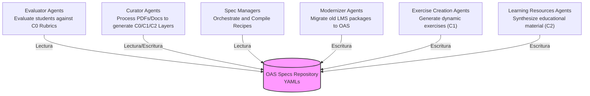
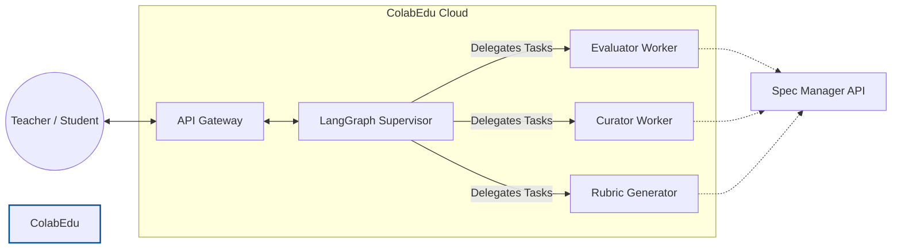

## The Agent Ecosystem and OAS

The OAS standard is not solely designed for evaluating exams. It is conceived as a structured *Data Lake* where a swarm of specialized artificial intelligences (each with a specific role) collaborates to autonomously create, update, and execute the educational lifecycle.

*   **Evaluator Agents (Evaluators):** Consume the read-only standard. They cross-reference the `ExerciseSpec` with the student's payload to issue precise mathematical scores and formative *feedback*.
*   **Curator Agents (Curators):** Are responsible for ingesting raw knowledge. They analyze documents, laws in PDF, or raw texts and generate the different layers of the standard (extracting C0 taxonomies, designing C1 tasks, or preparing C2 context banks), saving the result as new YAML files.
*   **Modernizer Agents (Modernizers):** Act as an *ETL Pipeline* for *legacy* systems. They ingest exported packages from traditional LMS platforms (Moodle, Canvas, Blackboard ZIP files, or formats like IMS QTI) and automatically transform them into the structural ecosystem of OAS.
*   **Exercise Creation Agents (Exercise Creators):** Use didactic specifications and pre-existing contexts to iteratively generate new dynamic exercises aligned with the standards, saving them as structured instances in OAS.
*   **Learning Resources Agents (Learning Resource Generators):** Responsible for distilling theoretical content and generating synthetic, adaptive, or pedagogical support educational material to feed the resource banks (C2).

## Agent Network: Implementation in ColabEdu

Within the ColabEdu infrastructure, this ecosystem does not operate in isolation. We use a multi-agent approach where an orchestrator model routes requests to specialized *Workers*, ensuring optimal performance and context isolation.

The **Supervisor (based on LangGraph)** acts as the traffic brain. It analyzes the user's intent (e.g., *"Evaluate this History essay"*) and exclusively awakens the *Evaluator Worker* with precise instructions. In turn, all these agents lack their own long-term memory; they use the **SpecManager API** as their single source of truth, ensuring that any change in law or rubric is immediately applied to all agents.