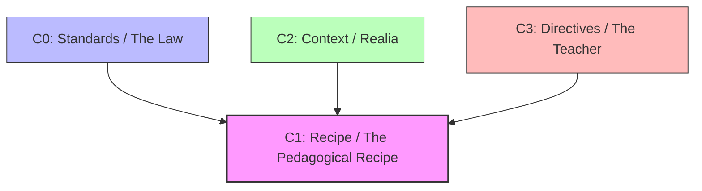

## "Assessment as Code"

ColabEdu resolved the technical crisis of monolithic LLMs by applying fundamental software engineering principles: the **MVC (Model-View-Controller)** pattern and **Dependency Injection**. We fragmented the assessment monolith into an atomic, versionable, and immutable "Layer Graph" (C0, C1, C2, C3).

### The Layer Graph (YAML) Explained

- **Layer C0 (Standards / The Law):** Vectorized dictionaries of pure rubrics (e.g., LOMLOE, AP, IB). They act as the immutable "Constitution" of the system.
- **Layer C2 (Context / Realia):** The "Semantic Ground". Pre-processed news articles or literature for *Retrieval-Augmented Generation* (RAG).
- **Layer C3 (Directives / The Teacher):** Override rules, pedagogical tone, and individual curricular adaptations.
- **Layer C1 (Recipe / The Pedagogical Recipe):** The instance that parameterizes and orchestrates the other layers. It specifies the `ExerciseType` (UI/engineering contract) to use and injects the law (C0), context (C2), and directives (C3).