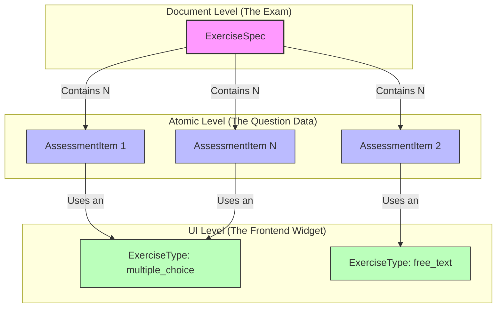

When we look at the OAS architecture from the perspective of traditional web development (where we usually have "Exams", "Questions", and "UI Components"), the entity names can seem a bit confusing at first.

This nomenclature exists because OAS merges **educational interoperability standards (IMS QTI)** with **Cloud-Native architecture patterns (Assessment as Code)**.

Below we explain the three fundamental entities that make up an interactive assessment instrument.

## Relationship Diagram

---

## 1. ExerciseSpec (The Container / The Document)
*Traditional equivalent: `ExamDocument`, `QuizContainer` or `Worksheet`*

The word "Spec" (Specification) comes from the Kubernetes-inspired architecture. In OAS, everything is defined through YAML files that declare a "desired state".
An `ExerciseSpec` is the master document or complete "booklet". It defines the general context (for example, a reading passage or a case study) and groups the list of questions that students must answer based on that context.

## 2. AssessmentItem (The Data Instance)
*Traditional equivalent: `QuestionInstanceData`*

This name is inherited directly from the global **IMS QTI (Question and Test Interoperability)** standard. In QTI, the atomic unit of assessment (the question itself, its options, its rubric, and the expected answer) is called an "Assessment Item".
In OAS, an `AssessmentItem` is purely a data payload. It contains no information about styles, colors, or interactivity; it simply stores *the what* of the question.

## 3. ExerciseType (The Visual Component)
*Traditional equivalent: `QuestionUIWidget` or `FrontendComponent`*

Since `AssessmentItem` is agnostic to visual presentation (it could be printed on paper or sent via SMS), we introduce the `ExerciseType`. This entity acts as the bridge to the frontend.
The `ExerciseType` strictly defines the graphical user interface (UI), such as a drag-and-drop widget (`drag_and_drop`), a free text box (`free_text`), or multiple-choice radio buttons (`multiple_choice`).

**Why separate it?**
This separation allows for massive reusability. You can have 10,000 distinct `AssessmentItems` about history, geography, or biology, and they will all use the same visual logic of a single `ExerciseType` (like `multiple_choice`). If you decide to redesign your multiple-choice buttons, you only modify the code of that `ExerciseType` once, and it will automatically update the appearance of all 10,000 questions.
