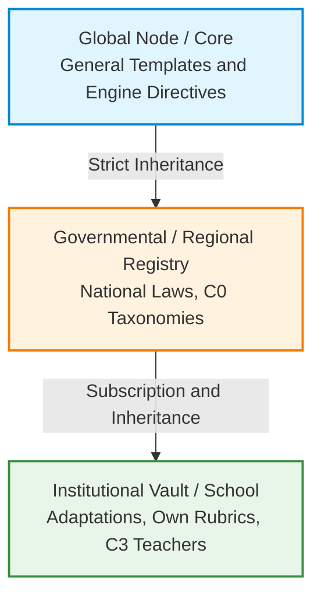

One of the biggest challenges in education is institutional and legal fragmentation. How do we ensure that a school in a specific region strictly complies with regional regulations, but at the same time can add its own institutional rubrics without breaking the central system?

ColabEdu's architecture solves this by implementing a **Federated Governance** model. This system allows the standard to scale globally, ensuring **Data Sovereignty** for each government and institution.

## The Network of Governance Nodes

Instead of having a single monolithic database where everyone must agree, OAS allows for the creation of a network of hierarchical nodes.

The inheritance model functions as a cascade (Fallback), always respecting local authority:

1.  **The Global Node (Core):** Defines the base technological templates (empty exercise types) and the absolute security rules for the AI engine.
2.  **The Governmental Registry:** Inherits technology from the global node but adds the **legal standards of its country** (e.g., key curriculum competencies). A Ministry of Education has absolute control over this vault, ensuring that no external entity alters its law.
3.  **The Institutional Vault:** A school or district "subscribes" to its government's registry. Additionally, if a teacher in this school creates a specific Biology rubric or a curricular adaptation for a student, it is saved exclusively in the school's private vault.

## Strategic Benefits

This decentralized design eradicates data collisions and enables unprecedented global scalability:

*   **Total Technological Sovereignty:** Governments and institutions do not "cede" their curricular data to a corporate black box; they maintain ownership and control of their own rule vault (their YAML files).
*   **Error Isolation:** If a school makes an error configuring an internal rubric, the impact is isolated to its vault and does not contaminate evaluations at the state level.
*   **Flexibility at the Base of the Pyramid:** Educators can innovate and iterate on their own methodologies (C3 Layer), securely and automatically relying on the solid legal foundation (C0 Layer) of their ministry.

> [!NOTE]
> **For Engineers and CTOs:** Under the hood, this data federation does not use traditional relational databases but is implemented using distributed infrastructure principles (*GitOps*). Each "Node" is a version control repository. This provides inherent advantages for forensic auditing, conflict resolution (*merges*), and change rollback in case of audits.