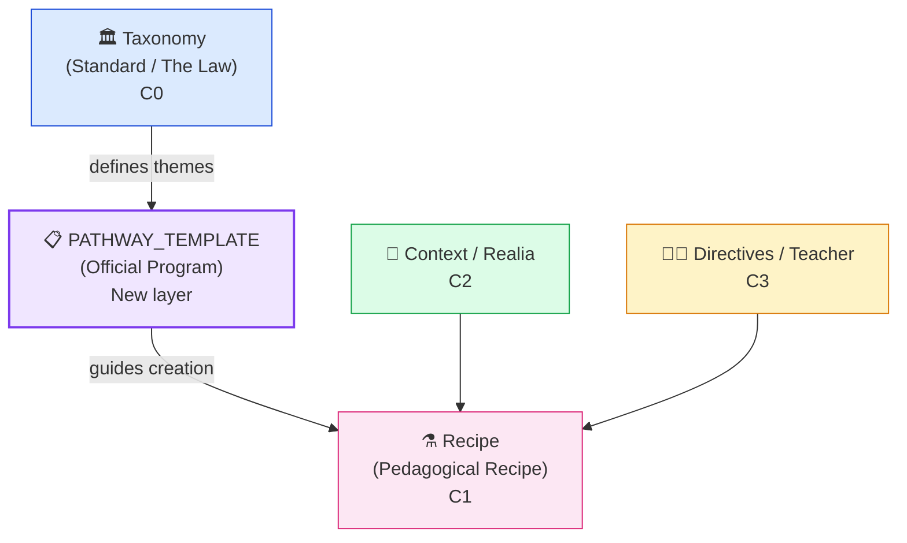

import { Badge, Card, CardGrid, Tabs, TabItem } from '@astrojs/starlight/components';

## What is a `PATHWAY_TEMPLATE`?

<Badge text="New in v0.6.10" variant="tip" />

A **`PATHWAY_TEMPLATE`** is an OAS specification type that acts as a **structured bridge** between Taxonomies (the curricular "law") and pedagogical Recipes (concrete exercises).

It defines the **official scaffold** of a specific study program — for example, all the themes, literary texts, and exam requirements of the IB Spanish B SL — in a versionable, Git-traceable YAML format.

---

## Position in the OAS Hierarchy



| Layer | OAS Type | Description | Mutability |
|---|---|---|---|
| C0 | `TAXONOMY` | Educational standards (IB, LOMLOE, AP…) | Immutable |
| **New** | **`PATHWAY_TEMPLATE`** | **Official program for a specific course** | **Versioned in Git** |
| C1 | `RECIPE` | Recipe for a specific exercise | Created by teacher |
| C2 | `CONTEXT` | Realia / source texts | Curated |
| C3 | `DIRECTIVE` | Teacher adjustments | Dynamic |

---

## Problem It Solves

Without `PATHWAY_TEMPLATE`, a teacher creating a *IB Spanish B SL* Pathway started from scratch: no topic structure, no reference texts, and no pre-loaded evaluation criteria.

**With `PATHWAY_TEMPLATE`**:

1. The creation wizard shows a list of applicable templates for the teacher's context (detected by country/standard).
2. On selecting `tmpl.ib.spanish_b.sl`, the Pathway auto-configures with the **5 IB themes**, thematic vocabulary, and exam evaluation criteria.
3. The `templateReferenceCode` is recorded in the Pathway metadata for **traceability and audit**.

---

## Anatomy of a `PATHWAY_TEMPLATE` (IB example)

<Tabs>
  <TabItem label="SL — Standard Level">
```yaml
apiVersion: oas/v1beta1
kind: PathwayTemplate
metadata:
  referenceCode: tmpl.ib.spanish_b.sl
  title: "IB Spanish B — Standard Level (SL)"
  description: >
    Official template for the IB Spanish B SL program.
    Structures the 5 IB curriculum themes with subtopics,
    essential vocabulary, and assessment guidance.
  authorityScope: GLOBAL
  tags: [ib, languages, spanish, sl]
spec:
  themes:
    - id: identities
      title: "Identities and personal relationships"
      order: 1
      subtopics:
        - Self-esteem and personal values
        - Family and friendship
        - Social groups and cultural influences
    - id: experiences
      title: "Experiences"
      order: 2
      subtopics:
        - Daily routines and leisure
        - Travel and rites of passage
        - Traditions and customs
    # ... (5 themes total)
  assessment:
    paper1:
      description: "Reading and listening comprehension"
      weighting: 0.25
    paper2:
      description: "Written production (2 texts)"
      weighting: 0.25
    internalOral:
      description: "Individual Oral (IO)"
      weighting: 0.30
```
  </TabItem>
  <TabItem label="HL — Higher Level">
```yaml
apiVersion: oas/v1beta1
kind: PathwayTemplate
metadata:
  referenceCode: tmpl.ib.spanish_b.hl
  title: "IB Spanish B — Higher Level (HL)"
  description: >
    Official template for the IB Spanish B HL program.
    Extends SL with critical intercultural analysis, two
    required literary works, and the HL Essay (600-900 words).
  authorityScope: GLOBAL
  tags: [ib, languages, spanish, hl]
spec:
  themes:
    - id: identities
      title: "Identities and personal relationships"
      order: 1
      hlExtension: >
        Deeper analysis of comparative cultural perspectives,
        critical debate on identity and social construction.
        Includes work with literary texts.
  literature:
    required: true
    works: 2
    hlEssay:
      wordCount: "600-900"
      description: >
        Comparison between works or between a work and a non-literary text.
  assessment:
    paper1:
      description: "More complex texts than SL"
      weighting: 0.25
    hlEssay:
      description: "Advanced analytical written production"
      weighting: 0.20
```
  </TabItem>
</Tabs>

---

## Integration with the Creation Wizard

When a teacher starts the **New Pathway** wizard, the system:

1. **Detects context**: country, educational standard of the school (IB, LOMLOE, etc.)
2. **Queries the API**: `GET /api/v1/taxonomy/options/pathway-templates?referenceCode=ib`
3. **Presents the selector**: optional dropdown with available templates
4. **Auto-fills**: on selecting a template, the title, description, and topic structure are propagated
5. **Persists traceability**: the `pathwayTemplateId` is recorded in the Pathway metadata

:::note[Non-Intrusive Design]
The template selector is **completely optional**. Teachers retain full pedagogical freedom to create Pathways from scratch if they prefer.
:::

---

## Template Catalog (v0.6.10)

<CardGrid>
  <Card title="IB Spanish B SL" icon="document">
    `tmpl.ib.spanish_b.sl`  
    5 IB themes + SL Exam Preparation  
    Paper 1, Paper 2, Individual Oral
  </Card>
  <Card title="IB Spanish B HL" icon="document">
    `tmpl.ib.spanish_b.hl`  
    5 themes + Literary Readings + HL Essay  
    Advanced critical intercultural analysis
  </Card>
</CardGrid>

:::tip[Roadmap]
Planned upcoming templates: **IB Mathematics AA/AI**, **AP Spanish Language**, **LOMLOE ESO Mathematics**, **Cambridge IGCSE English**.
:::

---

## Naming and Versioning

Templates follow the reference pattern: `tmpl.{standard}.{subject}.{level}.{component}`

```
tmpl.ib.spanish_b.sl              → root of SL template
tmpl.ib.spanish_b.sl.theme.identities  → specific theme
tmpl.ib.spanish_b.sl.exam_prep    → exam preparation pathway
tmpl.ib.spanish_b.hl.literature   → HL literary readings
```

Every change to a template is managed via **Pull Request in `ce-specs`**, treating the curriculum as audited, versioned code.
