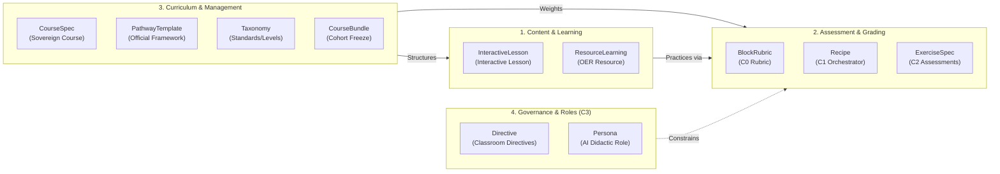

import { Badge, Card, CardGrid } from '@astrojs/starlight/components';
import SpecVersionViewer from '../../../../components/SpecVersionViewer.astro';

<SpecVersionViewer 
  specKind="OPS Specification Master Registry" 
  version="0.9.4" 
  status="ACTIVE" 
  schemaPath="catalog.json" 
/>

ColabEdu's **OPS (Open Pedagogy Specification)** architecture treats education as code (*Pedagogy as Code*). Every component of the pedagogical ecosystem—from statutory curriculum standards to exercise prompts or Socratic grading rubrics—is defined via a typed, immutable, and Git-auditable YAML specification.

To make the system immediately understandable for educators and engineers alike, specifications are grouped into **four functional categories**, cleanly separating the **Open Standard** schemas from the **Partner Automation Tooling**.

---

## 🏛️ The 4 Pedagogical Spec Categories



---

## 1. For Content and Learning (Classroom Experiences)

Specifications designed for **direct student interaction** with learning material. These are not static texts: they are dynamic, stateful learning units with embedded formative checks.

| Kind | Pedagogical Purpose | Designed by |
|---|---|---|
| [**InteractiveLesson**](/en/reference/interactive-lesson/) | **Multimedia interactive lessons**. Organized in slides with Markdown, LaTeX math, adaptive branches (*routes*), and embedded widgets (`quiz_widget`, `mermaid_viewer`, `scratchpad_widget`). | Content Authors / LMS Importers |
| [**ResourceLearning**](/en/reference/resource-learning/) | **Curated Open Educational Resource (OER) pointers** (videos, PhET simulations, open articles) annotated with a 3D pedagogical quality score (*alignment*, *pedagogicalRichness*, *accessibility*). | Curriculum Librarians / Educators |

---

## 2. For Assessment and Grading

Specifications that ensure **rigorous, reproducible, and curriculum-aligned assessment** matching statutory standards or standardized exams (EBAU, AP, IB).

| Kind | Pedagogical Purpose | Designed by |
|---|---|---|
| [**BlockRubric**](/en/reference/rubric/) | **The statutory source of truth (Layer C0)**. Defines official analytical criteria, qualitative achievement descriptors, and scoring bands. | Ministries, Quality Agencies, Exam Boards |
| [**Recipe**](/en/reference/recipe/) | **The pedagogical orchestrator (Layer C1)**. Connects target competencies, evaluation rubrics, report formatting, and feedback directives. | Instructional Designers / Dept Heads |
| [**ExerciseSpec**](/en/reference/exercise-spec/) | **Concrete assessment instrument (Layer C2)**. Contains the stimulus material (passage, audio, chart) and associated prompt questions. | Teachers / Content Authors |
| [**AssessmentItem**](/en/reference/assessment-item/) | **Atomic interactive assessment component**. An isolated item packaged for real-time frontend execution and evaluation. | Item Writers |
| [**ExerciseType**](/en/reference/exercise-type/) | **Agnostic interaction catalog**. Standardizes interaction formats: free-text, multiple-choice, matching, ordering, virtual whiteboard, etc. | Educational Engineers |

---

## 3. For Curriculum, Taxonomies, and Academic Governance

Specifications resolving **course structure, territorial sovereignty, and academic cohort lifecycles**.

| Kind | Pedagogical Purpose | Designed by |
|---|---|---|
| [**CourseSpec**](/en/reference/course-spec/) | **Sovereign course instance**. Specializes an educational standard for a specific school and delivery track (`FULL_YEAR`, `INTENSIVE`, `EXAM_MASTERY`, `REMEDIATION`), with targeted misconception libraries. | Schools / Academic Coordinators |
| [**PathwayTemplate**](/en/reference/pathway-template/) | **Official curriculum framework**. Structures a subject into units, estimated hours, and official exam component weights. | Standard Organizations (IB, College Board) |
| [**StandardSpec**](/en/reference/standard-spec/) | **Standard foundation spec**. Holds overarching guidelines and diagnostic misconception libraries for an educational framework. | Educational Authorities |
| [**Taxonomy**](/en/reference/taxonomy/) & [**TaxonomyIndex**](/en/reference/taxonomy-index/) | **Jurisdiction and grade hierarchy**. Encodes countries, regions, organizational levels, and transversal competencies as GitOps code. | Governance Teams |
| [**SubjectArea**](/en/reference/subject-area/) | **Unified subject taxonomy**. Classifies and normalizes academic disciplines globally (Mathematics, Spanish, Sciences). | Catalog Administrators |
| [**CourseBundle**](/en/reference/pathway-bundle/) | **Immutable snapshot artifact**. Packages courses and units to create immutable academic snapshots for cohort rollover or LMS export. | Academic Leadership / SysAdmins |

---

## 4. For Governance and Classroom Roles (Layer C3)

Specifications establishing the **ethical, didactic, and behavioral boundary** of AI in education.

| Kind | Pedagogical Purpose | Designed by |
|---|---|---|
| [**Directive**](/en/reference/directive/) | **Classroom didactic directives**. Teacher-imposed constraints (e.g., *"Never give direct answers"*, *"Use Socratic counter-questions"*). | Classroom Teacher |
| [**Persona**](/en/reference/persona/) | **Pedagogical tone and character**. Configures tutor demeanor (e.g., *Empathetic Socratic Tutor*, *Formal Exam Grader*). | School Counselors / Educators |

---

## 5. Partner Tooling (Content Factory & Automation)

:::caution[Reserved for Partners and Content Automation]
The following resources **do not represent static pedagogical content**; they are operational artifacts utilized by the **Autonomous Curator Agent (ACA)** and `ce-cli` for batch ingestion and curriculum auditing:
:::

- [**CuratorPlan**](/en/reference/curator-plan/): Persistent ingestion campaign tracking.
- [**CuratorBatch**](/en/reference/curator-batch/): Declarative multi-stage pipelines (`discover` $\to$ `parse` $\to$ `approval` $\to$ `ingest`).
- [**CurriculumRequirements**](/en/reference/curriculum-requirements/): Quantitative target rules for `CurriculumGapAnalyzer`.
- [**Gem**](/en/reference/gem/): Modular AI configuration packages for domain-specific curation.

---

## Canonical Universal Envelope (`colabedu/v1`)

```yaml
# --- UNIVERSAL OPS ENVELOPE ---
api_version: "colabedu/v1"         # Formal schema version
kind: "BLOCK_RUBRIC"               # Resource type from SpecType enum
metadata:
  reference_code: "us.ca.c0.spanish_2.rubric.oral_presentation.v1"
  title: "California Spanish 2 — Oral Presentation Rubric"
  version: "1.0.0"                 # Semantic version
  authority: "DISTRICT"            # GLOBAL | NATIONAL | DISTRICT | SCHOOL | TEACHER
  tags: ["cde", "california", "spanish_2", "speaking"]

# --- POLYMORPHIC PAYLOAD ---
spec:
  # Internal fields strictly defined by 'kind'
```

---

## ⚡ Dynamic Contract Governance & SSOT

Under OPS v0.9.4, specifications and reference documentation are governed through a **Single Source of Truth (SSOT)**:

1. **Formal Schemas (`ce-specs-registry`):** All schemas are written in YAML and compiled to JSON Schema Draft 2020-12 in `ce-specs-registry/dist/json-schemas/`.
2. **Canonical Examples:** Every specification kind has a tested example in `ce-specs-registry/examples/` validated via `pnpm test` (using `Ajv`).
3. **Live Auto-Synchronization:** The ColabEdu documentation site directly consumes the compiled JSON Schemas and canonical examples using the `<SpecVersionViewer />` component. Schema changes, field additions, or description updates propagate into the documentation in real time without manual edits.