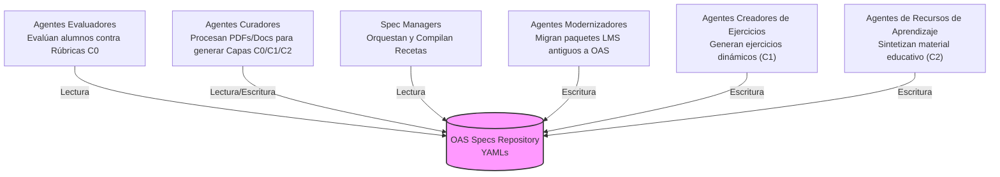
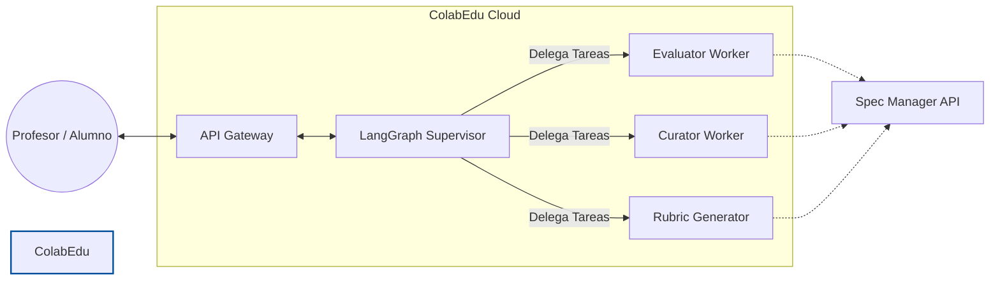

## El Ecosistema de Agentes y OAS

El estándar OAS no está diseñado únicamente para evaluar exámenes. Está concebido como un *Data Lake* estructurado donde un enjambre de inteligencias artificiales especializadas (cada una con un rol específico) colabora para crear, actualizar y ejecutar el ciclo de vida educativo de forma autónoma.

*   **Agentes Evaluadores (Evaluators):** Consumen el estándar de solo lectura. Cruzan el `ExerciseSpec` con el payload del alumno para emitir calificaciones matemáticas precisas y *feedback* formativo.
*   **Agentes Curadores (Curators):** Son los encargados de la ingesta de conocimiento en bruto. Analizan documentos, leyes en PDF o textos crudos y generan las diferentes capas del estándar (extrayendo taxonomías C0, diseñando tareas C1 o preparando bancos de contexto C2), guardando el resultado como nuevos archivos YAML.
*   **Agentes Modernizadores (Modernizers):** Actúan como un *Pipeline ETL* para sistemas *legacy*. Ingieren paquetes exportados de plataformas LMS tradicionales (archivos ZIP de Moodle, Canvas, Blackboard, o formatos como IMS QTI) y los transforman automáticamente al ecosistema estructural de OAS.
*   **Agentes Creadores de Ejercicios (Exercise Creators):** Utilizan las especificaciones didácticas y contextos preexistentes para generar iterativamente nuevos ejercicios dinámicos alineados con los estándares, guardándolos como instancias estructuradas en OAS.
*   **Agentes de Recursos de Aprendizaje (Learning Resource Generators):** Encargados de destilar el contenido teórico y generar material educativo sintético, adaptativo o de apoyo pedagógico para alimentar los bancos de recursos (C2).

## Red de Agentes: Implementación en ColabEdu

Dentro de la infraestructura de ColabEdu, este ecosistema no opera de forma aislada. Utilizamos un enfoque multi-agente donde un modelo orquestador enruta las solicitudes hacia *Workers* especializados, garantizando un rendimiento óptimo y aislamiento de contextos.

El **Supervisor (basado en LangGraph)** actúa como el cerebro de tráfico. Analiza la intención del usuario (ej. *"Evalúa este ensayo de Historia"*) y despierta exclusivamente al *Evaluator Worker* con las instrucciones precisas. A su vez, todos estos agentes carecen de memoria a largo plazo propia; utilizan el **SpecManager API** como su única fuente de verdad, asegurando que cualquier cambio en la ley o en la rúbrica se aplique inmediatamente a todos los agentes.
