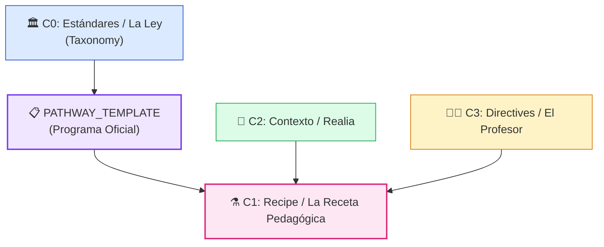

## "Assessment as Code"

ColabEdu resolvió la crisis técnica de los LLMs monolíticos aplicando principios fundamentales de ingeniería de software: el patrón **MVC (Model-View-Controller)** y la **Inyección de Dependencias**. Fragmentamos el monolito de evaluación en un "Grafo de Capas" atómicas, versionables e inmutables (C0, C1, C2, C3).

### El Grafo de Capas (YAML) Explicado

- **Capa C0 (Estándares / La Ley):** Diccionarios vectorizados de rúbricas puras (ej. LOMLOE, AP, IB). Actúan como la "Constitución" inmutable del sistema.
- **PATHWAY_TEMPLATE *(nueva capa)*:** Puente entre la ley (C0) y la receta concreta (C1). Define el andamio oficial de un programa específico (ej. *IB Spanish B SL*) con todos sus temas, textos y criterios de evaluación. [Ver documentación completa →](/es/oas-spec/architecture/pathway-template/)
- **Capa C2 (Contexto / Realia):** El "Suelo Semántico". Artículos de noticias o literatura preprocesados para *Retrieval-Augmented Generation* (RAG).
- **Capa C3 (Directives / El Profesor):** Reglas de sobrescritura, tono pedagógico y adaptaciones curriculares individuales.
- **Capa C1 (Recipe / La Receta Pedagógica):** La instancia que parametriza y orquesta a las demás capas. Especifica el `ExerciseType` (contrato UI/ingeniería) a utilizar e inyecta la ley (C0), el contexto (C2) y las directrices (C3).
