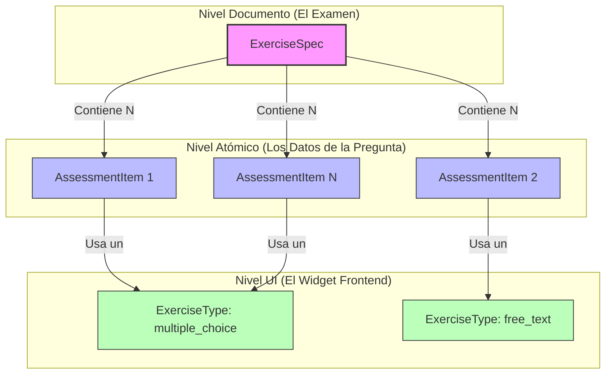

Cuando analizamos la arquitectura OAS desde la perspectiva del desarrollo web tradicional (donde solemos tener "Exámenes", "Preguntas" y "Componentes UI"), los nombres de las entidades pueden parecer un poco confusos al principio.

Esta nomenclatura existe porque OAS fusiona los **estándares de interoperabilidad educativa (IMS QTI)** con los **patrones de arquitectura Cloud-Native (Assessment as Code)**.

A continuación explicamos las tres entidades fundamentales que componen un instrumento de evaluación interactivo.

## Diagrama de Relaciones

---

## 1. ExerciseSpec (El Agrupador / El Documento)
*Equivalente tradicional: `ExamDocument`, `QuizContainer` o `Worksheet`*

La palabra "Spec" (Specification) proviene de la arquitectura inspirada en Kubernetes. En OAS, todo se define mediante archivos YAML que declaran un "estado deseado". 
Un `ExerciseSpec` es el documento maestro o "cuadernillo" completo. Define el contexto general (por ejemplo, un texto de lectura o un caso de estudio) y agrupa la lista de preguntas que los estudiantes deben responder basándose en ese contexto.

## 2. AssessmentItem (La Instancia de Datos)
*Equivalente tradicional: `QuestionInstanceData`*

Este nombre se hereda directamente del estándar global **IMS QTI (Question and Test Interoperability)**. En QTI, la unidad atómica de evaluación (la pregunta en sí, sus opciones, su rúbrica y la respuesta esperada) se llama "Assessment Item".
En OAS, un `AssessmentItem` es puramente un payload de datos. No contiene información sobre estilos, colores o interactividad; simplemente almacena *el qué* de la pregunta.

## 3. ExerciseType (El Componente Visual)
*Equivalente tradicional: `QuestionUIWidget` o `FrontendComponent`*

Dado que `AssessmentItem` es agnóstico a la presentación visual (podría imprimirse en papel o enviarse por SMS), introducimos el `ExerciseType`. Esta entidad actúa como el puente hacia el frontend. 
El `ExerciseType` define estrictamente la interfaz gráfica de usuario (UI), como un widget de arrastrar y soltar (`drag_and_drop`), una caja de texto libre (`free_text`), o botones de opción múltiple (`multiple_choice`). 

**¿Por qué separarlo?**
Esta separación permite una reutilización masiva. Puedes tener 10.000 `AssessmentItems` distintos sobre historia, geografía o biología, y todos utilizarán la misma lógica visual de un único `ExerciseType` (como `multiple_choice`). Si decides rediseñar tus botones de opción múltiple, solo modificas el código de ese `ExerciseType` una vez, y automáticamente actualizará la apariencia de las 10.000 preguntas.
