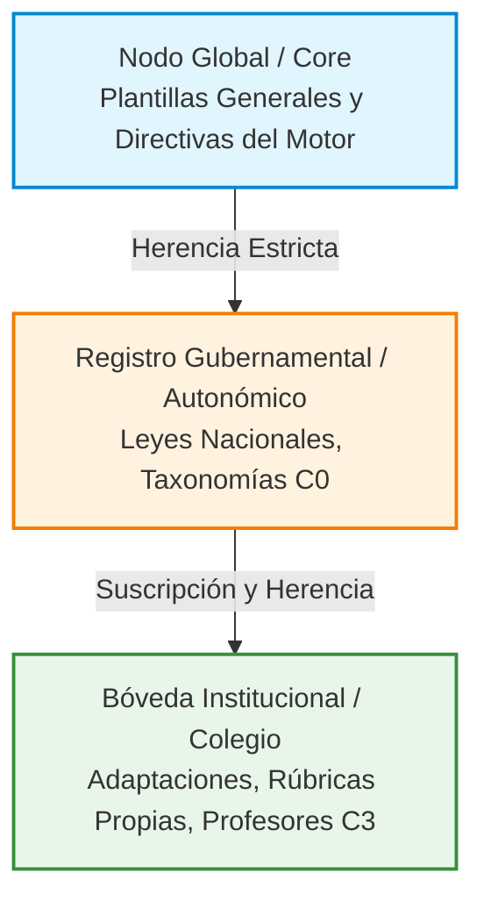

Uno de los mayores retos de la educación es la fragmentación institucional y legal. ¿Cómo aseguramos que un colegio en una región específica cumpla estrictamente con la normativa autonómica, pero al mismo tiempo pueda añadir sus propias rúbricas institucionales sin romper el sistema central?

La arquitectura de ColabEdu soluciona esto implementando un modelo de **Gobernanza Federada**. Este sistema permite escalar el estándar a nivel global garantizando la **Soberanía de Datos** para cada gobierno e institución.

## La Red de Nodos de Gobernanza

En lugar de tener una única base de datos monolítica donde todo el mundo deba ponerse de acuerdo, OAS permite la creación de una red de nodos jerárquicos.

El modelo de herencia funciona como una cascada (Fallback), respetando siempre la autoridad local:

1. **El Nodo Global (Core):** Define las plantillas tecnológicas base (los tipos de ejercicios vacíos) y las reglas absolutas de seguridad del motor de IA.
2. **El Registro Gubernamental:** Hereda la tecnología del nodo global, pero añade los **estándares legales de su país** (ej. competencias clave del currículo). Un Ministerio de Educación tiene el control absoluto de esta bóveda, garantizando que ninguna entidad externa altere su ley.
3. **La Bóveda Institucional:** Un colegio o distrito se "suscribe" al registro de su gobierno. Además, si un profesor en este colegio crea una rúbrica específica de Biología o una adaptación curricular para un alumno, se guarda exclusivamente en la bóveda privada del colegio. 

## Beneficios Estratégicos

Este diseño descentralizado erradica las colisiones de datos y permite una escalabilidad global sin precedentes:

*   **Soberanía Tecnológica Total:** Los gobiernos e instituciones no "ceden" sus datos curriculares a una caja negra corporativa; mantienen la propiedad y el control de su propia bóveda de reglas (sus archivos YAML).
*   **Aislamiento de Errores:** Si un colegio comete un error configurando una rúbrica interna, el impacto se aísla a su bóveda y no contamina las evaluaciones a nivel estatal.
*   **Flexibilidad en la Base de la Pirámide:** Los educadores pueden innovar e iterar sobre metodologías propias (Capa C3) apoyándose de manera segura y automática en la sólida base legal (Capa C0) de su ministerio.

> [!NOTE]
> **Para Ingenieros y CTOs:** Bajo el capó, esta federación de datos no utiliza bases de datos relacionales tradicionales, sino que se implementa mediante los principios de infraestructura distribuida (*GitOps*). Cada "Nodo" es un repositorio de control de versiones. Esto proporciona ventajas inherentes de auditoría forense, resolución de conflictos (*merges*) y reversión de cambios en caso de auditorías.
