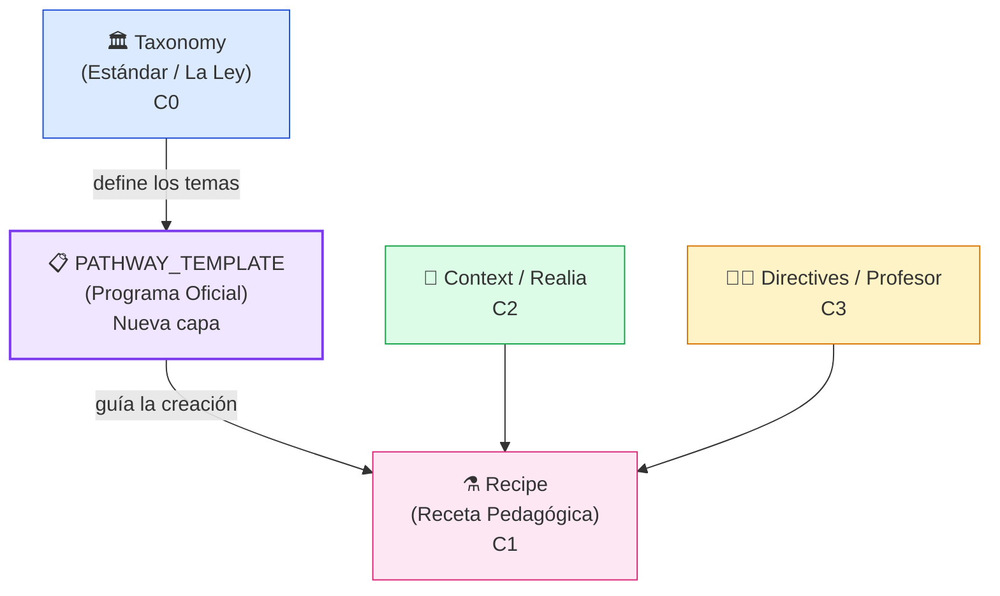

import { Badge, Card, CardGrid, Tabs, TabItem } from '@astrojs/starlight/components';

## ¿Qué es un `PATHWAY_TEMPLATE`?

<Badge text="Nuevo en v0.6.10" variant="tip" />

Un **`PATHWAY_TEMPLATE`** es un tipo de especificación OAS que actúa de **puente estructurado** entre las Taxonomías (la "ley" del currículo) y las Recetas pedagógicas (los ejercicios concretos).

Define el **andamio oficial** de un programa de estudios específico — por ejemplo, todos los temas, textos literarios y requisitos de examen del IB Spanish B SL — en un formato YAML versionable y trazable en Git.

---

## Posición en la Jerarquía OAS



| Capa | Tipo OAS | Descripción | Mutabilidad |
|---|---|---|---|
| C0 | `TAXONOMY` | Estándares educativos (IB, LOMLOE, AP…) | Inmutable |
| **Nueva** | **`PATHWAY_TEMPLATE`** | **Programa oficial de un curso concreto** | **Versionada en Git** |
| C1 | `RECIPE` | Receta de un ejercicio específico | Creada por el profesor |
| C2 | `CONTEXT` | Realia / textos fuente | Curada |
| C3 | `DIRECTIVE` | Ajustes del profesor | Dinámica |

---

## Problema que Resuelve

Sin `PATHWAY_TEMPLATE`, un profesor que crea un Pathway de *IB Spanish B SL* comenzaba desde cero: sin estructura de temas, sin textos de referencia y sin criterios de evaluación precargados.

**Con `PATHWAY_TEMPLATE`**:

1. El wizard de creación muestra una lista de plantillas aplicables al contexto del profesor (detectado por país/estándar).
2. Al seleccionar `tmpl.ib.spanish_b.sl`, el Pathway se auto-configura con los **5 temas IB**, el vocabulario temático y los criterios de evaluación del examen.
3. El `templateReferenceCode` queda grabado en los metadatos del Pathway para **trazabilidad y auditoría**.

---

## Anatomía de un `PATHWAY_TEMPLATE` (ejemplo IB)

<Tabs>
  <TabItem label="SL — Standard Level">
```yaml
apiVersion: oas/v1beta1
kind: PathwayTemplate
metadata:
  referenceCode: tmpl.ib.spanish_b.sl
  title: "IB Spanish B — Standard Level (SL)"
  description: >
    Plantilla oficial para el programa IB Spanish B SL.
    Estructura los 5 temas del currículo IB con subtemas,
    vocabulario esencial y orientaciones de evaluación.
  authorityScope: GLOBAL
  tags: [ib, languages, spanish, sl]
spec:
  themes:
    - id: identidades
      title: "Identidades y relaciones personales"
      order: 1
      subtopics:
        - Autoestima y valores personales
        - Familia y amistad
        - Grupos sociales e influencias culturales
    - id: experiencias
      title: "Experiencias"
      order: 2
      subtopics:
        - Rutinas diarias y ocio
        - Viajes y rites of passage
        - Tradiciones y costumbres
    # ... (5 temas totales)
  assessment:
    paper1:
      description: "Comprensión lectora y auditiva"
      weighting: 0.25
    paper2:
      description: "Producción escrita (2 textos)"
      weighting: 0.25
    internalOral:
      description: "Individual Oral (IO)"
      weighting: 0.30
```
  </TabItem>
  <TabItem label="HL — Higher Level">
```yaml
apiVersion: oas/v1beta1
kind: PathwayTemplate
metadata:
  referenceCode: tmpl.ib.spanish_b.hl
  title: "IB Spanish B — Higher Level (HL)"
  description: >
    Plantilla oficial para el programa IB Spanish B HL.
    Extiende SL con análisis crítico intercultural, dos
    obras literarias obligatorias y el HL Essay (600-900 palabras).
  authorityScope: GLOBAL
  tags: [ib, languages, spanish, hl]
spec:
  themes:
    - id: identidades
      title: "Identidades y relaciones personales"
      order: 1
      hlExtension: >
        Análisis más profundo de perspectivas culturales comparadas,
        debate crítico sobre identidad y construcción social.
        Incluye trabajo con textos literarios.
  literature:
    required: true
    works: 2
    hlEssay:
      wordCount: "600-900"
      description: >
        Comparación entre obras o entre obra y texto no literario.
  assessment:
    paper1:
      description: "Textos más complejos que SL"
      weighting: 0.25
    hlEssay:
      description: "Producción escrita analítica avanzada"
      weighting: 0.20
```
  </TabItem>
</Tabs>

---

## Integración con el Wizard de Creación

Cuando un profesor inicia el wizard de **Nuevo Pathway**, el sistema:

1. **Detecta el contexto**: país, estándar educativo del centro (IB, LOMLOE, etc.)
2. **Consulta el API**: `GET /api/v1/taxonomy/options/pathway-templates?referenceCode=ib`
3. **Presenta el selector**: dropdown opcional con las plantillas disponibles
4. **Auto-rellena**: al elegir una plantilla, se propagan título, descripción y estructura temática
5. **Persiste la trazabilidad**: el `pathwayTemplateId` queda grabado en los metadatos del Pathway

:::note[Diseño No Intrusivo]
El selector de plantilla es **completamente opcional**. Los profesores retienen plena libertad pedagógica para crear Pathways desde cero si lo prefieren.
:::

---

## Catálogo de Templates (v0.6.10)

<CardGrid>
  <Card title="IB Spanish B SL" icon="document">
    `tmpl.ib.spanish_b.sl`  
    5 temas IB + Preparación Examen SL  
    Paper 1, Paper 2, Individual Oral
  </Card>
  <Card title="IB Spanish B HL" icon="document">
    `tmpl.ib.spanish_b.hl`  
    5 temas + Lecturas Literarias + HL Essay  
    Análisis crítico intercultural avanzado
  </Card>
</CardGrid>

:::tip[Roadmap]
Próximas plantillas planificadas: **IB Mathematics AA/AI**, **AP Spanish Language**, **LOMLOE ESO Matemáticas**, **Cambridge IGCSE English**.
:::

---

## Nomenclatura y Versionado

Los templates siguen el patrón de referencia: `tmpl.{estándar}.{asignatura}.{nivel}.{componente}`

```
tmpl.ib.spanish_b.sl              → raíz del template SL
tmpl.ib.spanish_b.sl.theme.identidades  → tema específico
tmpl.ib.spanish_b.sl.exam_prep    → pathway de preparación al examen
tmpl.ib.spanish_b.hl.literature   → lecturas literarias HL
```

Todo cambio en un template se gestiona vía **Pull Request en `ce-specs`**, tratando el currículo como código auditado y versionado.
