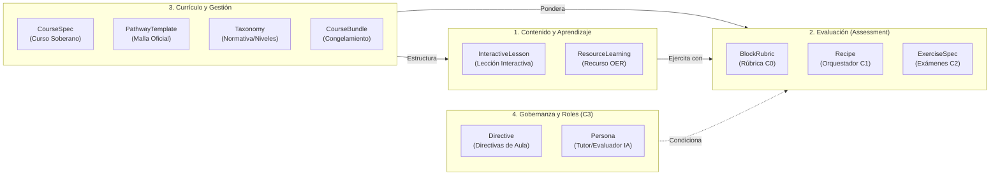

import { Badge, Card, CardGrid } from '@astrojs/starlight/components';

La arquitectura **OPS (Open Pedagogy Specification)** de ColabEdu trata la educación como código (*Pedagogy as Code*). Cada componente del ecosistema educativo —desde la ley curricular hasta el enunciado de una pregunta o la pauta de corrección socrática— se define mediante un archivo YAML tipado, inmutable y auditable en Git.

Para facilitar su comprensión pedagógica y técnica, las especificaciones se organizan en **cuatro categorías funcionales**, diferenciando claramente los esquemas del **Estándar Abierto** de las **Herramientas de Automatización para Partners**.

---

## 🏛️ Las 4 Categorías Pedagógicas de Specs



---

## 1. Para Contenido y Aprendizaje (Experiencias de Aula)

Especificaciones orientadas a la **interacción directa del estudiante** con el material didáctico. No son meros textos estáticos: son unidades interactivas con estados de avance y evaluación formativa embebida.

| Tipo (Kind) | Propósito Pedagógico | Diseñado por |
|---|---|---|
| [**InteractiveLesson**](/reference/interactive-lesson/) | **Lecciones interactivas multimedia**. Organizadas en slides con soporte Markdown, fórmulas matemáticas, bifurcaciones adaptativas (*routing*) y widgets interactivos (`quiz_widget`, `mermaid_viewer`, `scratchpad_widget`). | Creadores de contenido / Importadores LMS |
| [**ResourceLearning**](/reference/resource-learning/) | **Punteros curados a Recursos Educativos Abiertos (OER)** (vídeos, simulaciones PhET, lecturas abiertas) anotados con un índice de calidad pedagógica tridimensional (*alignment*, *pedagogicalRichness*, *accessibility*). | Bibliotecarios curriculares / Docentes |

---

## 2. Para Evaluación (Assessment y Calificación)

Especificaciones que garantizan una **evaluación rigurosa, reproducible y alineada con la ley** o con exámenes oficiales (EBAU, AP, IB).

| Tipo (Kind) | Propósito Pedagógico | Diseñado por |
|---|---|---|
| [**BlockRubric**](/reference/rubric/) | **La fuente de verdad normativa (Capa C0)**. Define criterios analíticos oficiales, descriptores cualitativos por banda de logro y escalas de puntuación. | Ministerios, Agencias de Calidad, Comités de Examen |
| [**Recipe**](/reference/recipe/) | **El orquestador pedagógico (Capa C1)**. Vincula qué competencias evaluar, qué rúbrica aplicar, qué formato de informe emitir y qué directivas de retroalimentación debe seguir el evaluador. | Diseñadores Instruccionales / Jefes de Departamento |
| [**ExerciseSpec**](/reference/exercise-spec/) | **Instrumento de evaluación concreto (Capa C2)**. Contiene el estímulo (texto, audio, gráfico) y las preguntas asociadas listas para que el alumno responda. | Docentes / Autores de Contenido |
| [**AssessmentItem**](/reference/assessment-item/) | **Componente atómico de evaluación interactiva**. Reactivo aislado empaquetado para su resolución y corrección inmediata en el frontend. | Diseñadores de ítems |
| [**ExerciseType**](/reference/exercise-type/) | **Catálogo de interacciones agnósticas**. Define la mecánica de interacción: texto libre, test de opciones múltiples, emparejamiento, ordenación, pizarra, etc. | Ingenieros pedagógicos |

---

## 3. Para Currículo, Taxonomías y Gestión Académica

Especificaciones que resuelven la **arquitectura del plan de estudios**, la soberanía territorial y la gestión del ciclo lectivo.

| Tipo (Kind) | Propósito Pedagógico | Diseñado por |
|---|---|---|
| [**CourseSpec**](/reference/course-spec/) | **Unidad soberana de curso**. Adapta un estándar oficial a un centro educativo concreto, configurando la modalidad de impartición (`FULL_YEAR`, `INTENSIVE`, `EXAM_MASTERY`, `REMEDIATION`) y librerías de errores comunes (*misconceptions*). | Centros Educativos / Coordinadores |
| [**PathwayTemplate**](/reference/pathway-template/) | **Malla curricular oficial**. Estructura un curso en temas, horas estimadas y ponderaciones oficiales de examen (ej. Paper 1: 25%, Paper 2: 50%). | Organizaciones oficiales (IB, College Board, CCAA) |
| [**StandardSpec**](/reference/standard-spec/) | **Configuración marco del estándar educativo**. Agrupa las directrices globales y bibliotecas de dificultades diagnósticas del estándar. | Administraciones Educativas |
| [**Taxonomy**](/reference/taxonomy/) & [**TaxonomyIndex**](/reference/taxonomy-index/) | **Jerarquías de localización y niveles**. Codifica países, regiones (CCAA, distritos), etapas educativas y competencias clave como código GitOps. | Equipos de Gobernanza |
| [**SubjectArea**](/reference/subject-area/) | **Área de conocimiento unificada**. Clasificación y normalización transversal de asignaturas (Matemáticas, Lengua, Idiomas). | Administradores de Catálogo |
| [**CourseBundle**](/reference/pathway-bundle/) | **Artefacto de congelamiento inmutable**. Agrupa cursos y unidades para generar snapshots escolares inmutables por año lectivo, exportación a LMS o distribución. | Dirección Académica / Administradores |

---

## 4. Para Gobernanza y Roles en el Aula (Capa C3)

Especificaciones que establecen el **marco ético, didáctico y actitudinal** dentro del entorno digital de aprendizaje.

| Tipo (Kind) | Propósito Pedagógico | Diseñado por |
|---|---|---|
| [**Directive**](/reference/directive/) | **Directivas didácticas de aula**. Reglas docentes para el motor (por ejemplo: *"No dar la respuesta directa al alumno"*, *"Formular repreguntas socráticas en español peninsular"*). | Docente del aula |
| [**Persona**](/reference/persona/) | **Perfil y tono pedagógico**. Configura la personalidad del asistente (ej. *Tutor Socrático Empático*, *Examinador Formal EBAU*). | Equipos de Orientación / Docentes |

---

## 5. Herramientas para Partners (Content Factory y Automatización)

:::caution[Herramientas para Partners y Equipos de Automatización]
Las siguientes especificaciones **no representan contenidos pedagógicos estáticos**, sino artefactos operacionales utilizados por la **Factoría de Contenido (ACA)** y el CLI `ce-cli` para la ingesta y auditoría masiva de currículos:
:::

- [**CuratorPlan**](/reference/curator-plan/): Registro de campañas de ingesta persistente gestionadas por el Agente Curador.
- [**CuratorBatch**](/reference/curator-batch/): Ficheros declarativos de pipeline por fases (`discover` $\to$ `parse` $\to$ `approval` $\to$ `ingest`).
- [**CurriculumRequirements**](/reference/curriculum-requirements/): Reglas para el `CurriculumGapAnalyzer` sobre el número de ejercicios y rúbricas requeridas para completar un temario.
- [**Gem**](/reference/gem/): Módulos de inteligencia artificial configurables para tareas de curación especializada.

---

## Estructura Universal del Archivo YAML (`colabedu/v1`)

Cualquier especificación OPS —sea una rúbrica, una lección interactiva o una taxonomía nacional— sigue el sobre universal (*Universal Envelope*) normalizado:

```yaml
# --- CABECERA CANÓNICA UNIVERSAL ---
api_version: "colabedu/v1"         # Versión formal del esquema
kind: "BLOCK_RUBRIC"               # Tipo de recurso según SpecType
metadata:
  reference_code: "es.madrid.c0.lengua.ebau.texto_argumentativo.v1"
  title: "Rúbrica EBAU Madrid — Comentario de Texto Argumentativo"
  version: "1.0.0"                 # Versionado semántico
  authority: "NATIONAL"            # GLOBAL | NATIONAL | DISTRICT | SCHOOL | TEACHER
  tags: ["lomloe", "ebau", "madrid", "lengua", "bachillerato"]

# --- CUERPO POLIMÓRFICO ---
spec:
  # Los campos internos dependen estrictamente del 'kind' especificado
```

> **Compatibilidad:** El motor `SpecManager` acepta tanto la nomenclatura estricta (`kind: BLOCK_RUBRIC`, `api_version: "colabedu/v1"`) como los alias históricos (`kind: Rubric`, `apiVersion: colabedu.ai/v1beta1`) garantizando la retrocompatibilidad con repositorios existentes.

---

## ⚡ Gobernanza Dinámica de Contratos y Fuente Única de Verdad (SSOT)

Bajo OPS v0.9.4, los contratos de especificación y la documentación de referencia están gobernados por una **Fuente Única de Verdad (SSOT)**:

1. **Esquemas Formales (`ce-specs-registry`):** Definidos en YAML y compilados automáticamente a JSON Schema Draft 2020-12 en `ce-specs-registry/dist/json-schemas/`.
2. **Ejemplos Canónicos Validados:** Cada tipo de recurso cuenta con un ejemplo canónico en `ce-specs-registry/examples/` validado continuamente mediante `pnpm test` (con `Ajv`).
3. **Auto-Sincronización en Vivo:** La web de documentación (`ce-web`) consume directamente los esquemas y ejemplos mediante el componente `<SpecVersionViewer />`. Cualquier evolución del esquema en el registro se refleja inmediatamente en la documentación sin mantenimiento manual de tablas.
